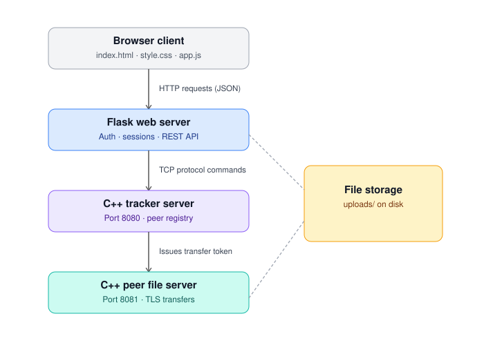

# P2P File Transfer System

A peer-to-peer file-sharing system with TLS-encrypted transfers, a centralized tracker for peer/file discovery, token-based access control, and a web UI.

**Features:** Peer-to-peer transfers | TLS 1.2+ encryption | Token auth | Path traversal protection | Streaming I/O | Range requests | SHA-256 integrity checks | Multi-threaded | Cross-platform

## Architecture



- **Browser** — HTML/CSS/JS UI for login, upload, browse, download
- **Flask Web Server** — auth, sessions, REST API bridge to the tracker
- **C++ Tracker Server** — peer registry, file listing, issues transfer tokens
- **C++ Peer File Server** — serves file bytes over TLS, validated by token

## Quick Start

```bash
git clone <repo-url> && cd p2p-file-transfer
python -m venv venv && source venv/bin/activate
pip install -r requirements.txt

mkdir build && cd build && cmake .. && make
cd ..

./start.sh   # or start.bat on Windows
```

## Protocol

**Tracker (TCP 8080):** `CONNECT`, `LIST`, `UPLOAD`, `DOWNLOAD`, `DELETE`, `PUBLIC`, `PRIVATE`, `DISCONNECT`

**Peer File Server (TLS 8081):** `GET <filename> <offset> <length> <token>`, `HASH <filename> <token>`

## Directory Structure

```
├── src/          # C++ sources
├── include/      # C++ headers
├── web/          # Flask + UI
├── build/        # Compiled binaries
├── certs/        # TLS certificates (auto-generated)
├── uploads/      # File storage
├── CMakeLists.txt
├── requirements.txt
└── start.sh / start.bat
```
